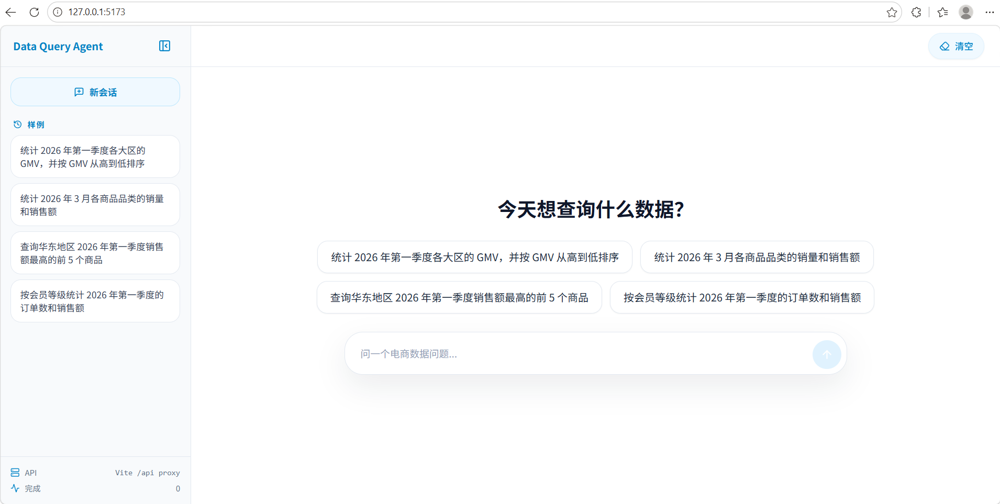
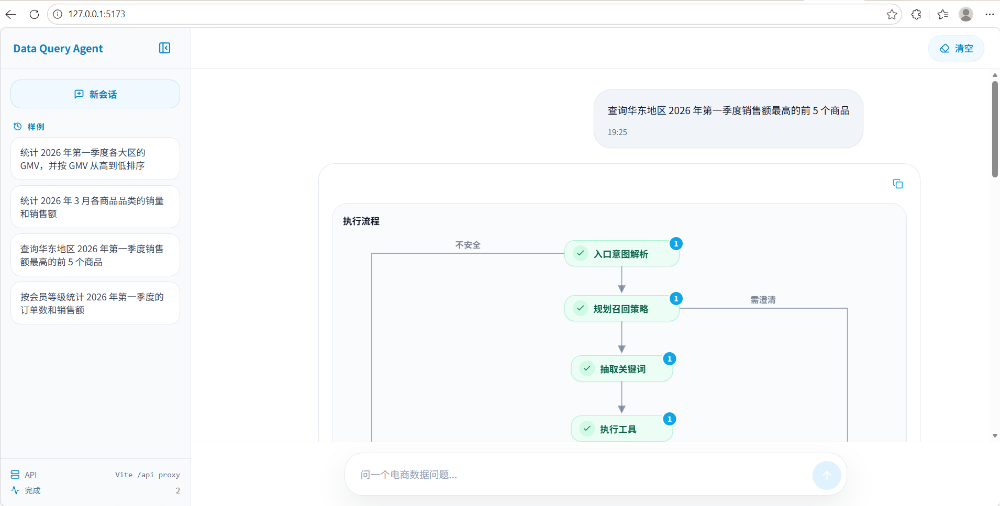
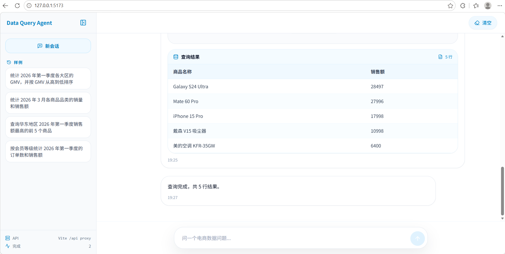
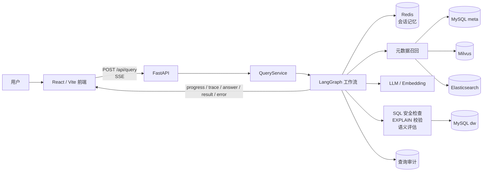

# Data Query Agent

<p align="left">
  
  
  
  
  
  
  
</p>

Data Query Agent 是一个面向业务数仓的中文自然语言问数项目。它使用 LangGraph 编排从意图解析、元数据召回、SQL 生成、安全校验、数据库校验、语义评估到查询执行与审计的完整链路，并通过 SSE 将执行进度、关键轨迹、普通回答和查询结果实时返回给前端。

## 界面预览

### 首页与示例问题



### 执行流程追踪



### 查询结果展示



## 功能特性

- **自然语言问数**：将中文业务问题转换为可执行 SQL，并返回结构化查询结果。
- **混合元数据检索**：使用 Milvus 召回字段和指标语义信息，使用 Elasticsearch 召回字段真实取值。
- **多轮会话记忆**：基于 Redis 保存会话上下文，支持追问、省略表达和超过阈值后的上下文压缩。
- **SQL 安全治理**：内置函数白名单、跨库访问限制、最大返回行数和执行超时控制。
- **可观测 Agent 工作流**：通过 `progress` 与 `trace` SSE 事件暴露关键节点进度、摘要和结构化元数据。
- **自动修正与语义评估**：在 SQL 校验或语义评估失败时进入受控修正链路，并限制重试次数。
- **查询审计与回归评测**：记录查询过程，支持单轮问题和多轮会话评测用例。
- **前后端一体化体验**：FastAPI 提供流式接口，React 前端展示对话、流程轨迹和结果表格。

## 架构概览



### 工作流

```text
用户问题
  -> 入口解析（多轮补全 / 意图识别 / 安全拦截）
  -> 普通聊天直接回答，危险意图直接终止
  -> 数据查询进入召回策略规划
  -> 抽取关键词
  -> 按规划执行字段 / 指标 / 字段值召回
  -> 合并召回信息
  -> 过滤查询上下文
  -> 添加日期和数据库环境上下文
  -> SQL 生成
  -> SQL 安全检查
  -> 数据库 EXPLAIN 校验
  -> SQL 语义评估
  -> 必要时修正 SQL 并重新检查
  -> SQL 执行与审计收尾
  -> SSE 返回进度、轨迹、回答、结果或错误
```

## 技术栈

| 模块            | 技术                                     | 说明                                                 |
| --------------- | ---------------------------------------- | ---------------------------------------------------- |
| 后端接口        | FastAPI / Pydantic                       | 提供问数 API、SSE 流式响应和 OpenAPI 文档            |
| Agent 编排      | LangGraph                                | 组织入口解析、召回、SQL 生成、校验、评估、修正和执行 |
| 元数据库        | MySQL / SQLAlchemy                       | 保存表、字段、指标、字段指标关系和查询审计           |
| 示例数仓        | MySQL                                    | 保存订单事实表和地区、客户、商品、日期维表           |
| 向量检索        | Milvus                                   | 召回字段和指标的语义信息                             |
| 全文检索        | Elasticsearch + IK                       | 召回字段真实取值和关键词匹配结果                     |
| 会话记忆        | Redis                                    | 保存多轮会话短期记忆和压缩上下文                     |
| LLM / Embedding | DashScope 兼容 OpenAI 接口               | 生成 SQL、评估回答质量和生成向量                     |
| 前端            | React / Vite / TypeScript / Tailwind CSS | 展示聊天式问数、执行轨迹和结果表格                   |
| 质量工具        | pytest / ruff / pnpm build               | 覆盖后端单测、代码检查和前端构建检查                 |

## 快速开始

### 环境要求

- Python `>= 3.12`
- `uv`
- Docker 与 Docker Compose
- Node.js 与 `pnpm`

### 1. 安装后端依赖

```bash
uv sync
```

### 2. 配置环境变量

```bash
cp .env.example .env
```

编辑 `.env`，填写可用的大模型 API Key：

```bash
LLM_API_KEY=your_real_api_key
```

### 3. 启动基础服务

```bash
docker compose -f docker/docker-compose.yaml up -d
```

Docker Compose 会启动 MySQL、Elasticsearch、Kibana、Redis、Milvus 及其依赖服务，并加载 `docker/mysql` 下的初始化 SQL。

| 服务          | 本地端口  | 用途                               |
| ------------- | --------- | ---------------------------------- |
| MySQL         | `3307`  | 元数据库`meta` 与示例数仓 `dw` |
| Elasticsearch | `9201`  | 字段值全文检索                     |
| Kibana        | `5602`  | Elasticsearch 调试                 |
| Redis         | `6379`  | 会话记忆                           |
| Milvus        | `19530` | 向量检索                           |

默认 MySQL 开发账号：

```text
user: data_query_agent
password: data_query_123
```

### 4. 构建元数据知识库

```bash
uv run python -m app.scripts.build_meta_knowledge -c conf/meta_config.yaml
```

该命令会把表字段元数据写入 MySQL，把字段和指标向量写入 Milvus，并把配置为 `sync: true` 的字段真实取值写入 Elasticsearch。

### 5. 启动后端

```bash
uv run fastapi dev main.py
```

后端启动后可访问：

```text
API:  http://127.0.0.1:8000/api/query
Docs: http://127.0.0.1:8000/docs
```

### 6. 启动前端

```bash
cd frontend
pnpm install
pnpm dev
```

前端默认通过 Vite 代理把 `/api` 转发到 `http://127.0.0.1:8000`。本地开发地址通常为：

```text
http://127.0.0.1:5173
```

## 配置说明

| 文件                                        | 说明                                                                      |
| ------------------------------------------- | ------------------------------------------------------------------------- |
| [.env.example](.env.example)                   | 后端环境变量示例，目前主要包含`LLM_API_KEY`                             |
| [conf/app_config.yaml](conf/app_config.yaml)   | 日志、MySQL、Milvus、Elasticsearch、Redis、LLM、Embedding 和 SQL 安全配置 |
| [conf/meta_config.yaml](conf/meta_config.yaml) | 示例数据域的表、字段、别名、指标和字段同步配置                            |
| [frontend/.env.example](frontend/.env.example) | 前端 API 基址与 Vite 开发代理配置                                         |

默认 LLM 与 Embedding 使用兼容 OpenAI 接口的 DashScope 服务：

```yaml
embedding:
  model: text-embedding-v4
  dimension: 1024
  api_key: ${oc.env:LLM_API_KEY}
  base_url: https://dashscope.aliyuncs.com/compatible-mode/v1

llm:
  model_name: qwen3.7-plus
  api_key: ${oc.env:LLM_API_KEY}
  base_url: https://dashscope.aliyuncs.com/compatible-mode/v1
```

如需切换模型服务，可调整 `model_name`、`api_key` 和 `base_url`。

## API

### `POST /api/query`

请求体：

```json
{
  "query": "查询华东地区 2026 年第一季度销售额最高的前 5 个商品",
  "conversation_id": "demo-session"
}
```

请求示例：

```bash
curl -N http://127.0.0.1:8000/api/query \
  -H "Content-Type: application/json" \
  -H "Accept: text/event-stream" \
  -d '{"query":"统计 2026 年第一季度各大区的 GMV，并按 GMV 从高到低排序","conversation_id":"demo-session"}'
```

接口返回 `text/event-stream`。每条 SSE 消息的 `data` 字段是 JSON 字符串，事件类型如下：

| 类型         | 含义                               |
| ------------ | ---------------------------------- |
| `progress` | 节点执行进度                       |
| `trace`    | 关键节点的摘要、明细和结构化元数据 |
| `answer`   | 普通聊天或澄清问题的直接回答       |
| `result`   | 最终查询结果                       |
| `error`    | 异常消息                           |

示例事件：

```text
data: {"type":"progress","step":"生成SQL","status":"running"}

data: {"type":"trace","step":"入口解析","title":"入口解析完成","metadata":{"intent_category":"data_query"}}

data: {"type":"result","data":[{"商品名称":"Galaxy S24 Ultra","销售额":28497}]}
```

## 评测

评测用例位于 [eval/cases.yaml](eval/cases.yaml)，支持单轮问题和多轮会话。运行前请先启动基础服务，并完成元数据知识库构建。

运行完整评测：

```bash
uv run python -m app.scripts.run_eval -c eval/cases.yaml
```

运行单个用例：

```bash
uv run python -m app.scripts.run_eval -c eval/cases.yaml --case-id east_top_products
```

设置最低通过率：

```bash
uv run python -m app.scripts.run_eval -c eval/cases.yaml --min-pass-rate 0.8
```

评测报告会生成到：

```text
eval/reports/latest.json
eval/reports/latest.md
```

## 开发检查

提交前建议执行：

```bash
uv run ruff check .
uv run pytest
```

前端检查：

```bash
cd frontend
pnpm build
```

## 项目结构

```text
data-query-agent/
├── app/
│   ├── agent/            # LangGraph 图、状态、上下文、工具和节点
│   ├── api/              # FastAPI 路由、依赖注入、Schema 和生命周期
│   ├── clients/          # MySQL、Milvus、Elasticsearch、Redis、Embedding 客户端管理
│   ├── conf/             # 配置 dataclass 与配置加载
│   ├── core/             # 日志和 request_id 上下文
│   ├── entities/         # 业务语义数据对象
│   ├── evaluation/       # 评测执行器
│   ├── models/           # SQLAlchemy ORM 模型
│   ├── prompt/           # Prompt 加载工具
│   ├── repositories/     # 数据访问层
│   ├── scripts/          # 元数据知识库构建与评测脚本
│   └── services/         # 查询服务、会话记忆和元数据构建服务
├── conf/                 # app_config.yaml、meta_config.yaml
├── docker/               # Docker Compose、MySQL 初始化 SQL、ES 插件
├── docs/images/          # README 界面预览图片
├── eval/                 # 评测用例、评测说明和报告
├── frontend/             # React 前端项目
├── prompts/              # SQL 生成、修正、过滤、上下文压缩等 Prompt 模板
├── tests/                # 后端服务、图节点、评测和前端契约测试
├── main.py               # FastAPI 应用入口
└── pyproject.toml        # Python 项目依赖与工具配置
```

## 能力边界

当前项目聚焦可运行的智能问数主链路，已包含 SQL 安全检查、查询审计、会话短期记忆、基础评测用例和前端流程展示。以下能力尚未覆盖，可按生产场景继续扩展：

- 用户登录、租户隔离和角色权限
- 行列级数据权限与敏感字段脱敏
- 查询缓存、限流、熔断和监控告警
- 更完整的元数据治理、血缘分析和指标口径管理
- CI/CD、灰度发布和生产级部署脚本
