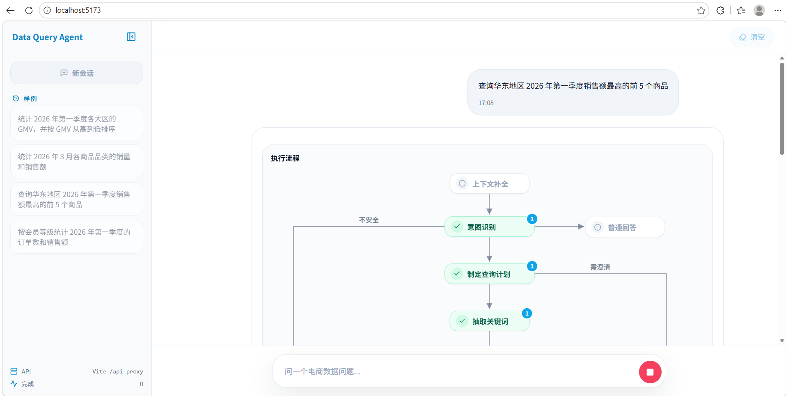
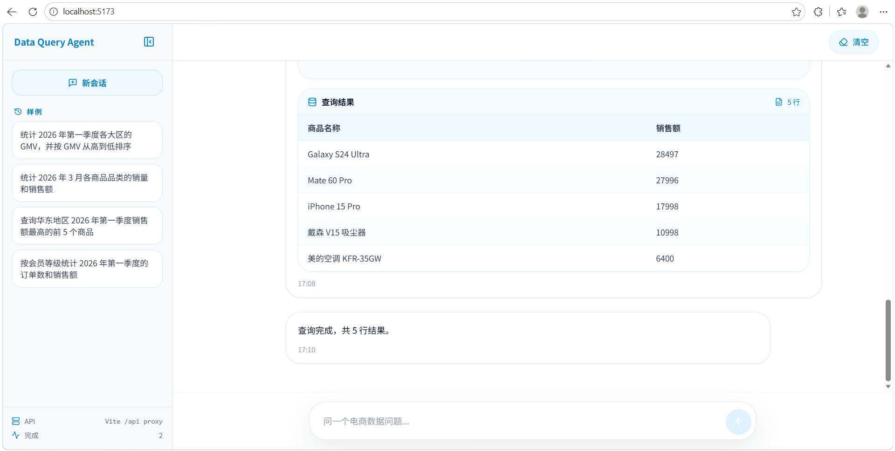

# 智能问数助手 / Data Query Agent

<p align="left">
  
  
  
  
  
  
  
</p>

Data Query Agent 是一个面向业务数仓的自然语言问数项目。用户用中文提出分析问题，系统会召回相关表字段、指标和值域信息，组织上下文生成 SQL，完成安全检查、自动修正、执行与审计，并通过 SSE 把执行进度和查询结果实时返回给前端。

## 核心能力

- 自然语言问数：将业务问题转换为可执行 SQL，并返回结构化查询结果。
- 混合元数据检索：使用 Milvus 召回字段和指标语义信息，使用 Elasticsearch 召回字段真实取值。
- 多轮会话记忆：基于 Redis 保存会话消息，并在超过阈值后压缩上下文，支持追问和省略表达。
- SQL 安全治理：对生成 SQL 做函数白名单、跨库访问、返回行数和超时约束等检查。
- 查询审计与评测：记录查询过程，支持单轮问数和多轮会话评测用例。
- LangGraph 工作流：串联意图识别、上下文补全、召回、过滤、SQL 生成、校验、修正、执行和结果评估。
- 流式用户体验：后端通过 SSE 返回节点进度、最终结果和错误信息，前端展示对话、步骤轨迹和结果表格。

## 技术栈

| 模块 | 技术 | 作用 |
| --- | --- | --- |
| 后端接口 | FastAPI | 提供问数 API、SSE 响应和生命周期管理 |
| 智能编排 | LangGraph | 组织多阶段问数工作流 |
| 元数据库 | MySQL / SQLAlchemy | 保存表、字段、指标、字段指标关系和查询审计 |
| 示例数仓 | MySQL | 保存业务查询用事实表和维度表 |
| 向量检索 | Milvus | 支持字段和指标语义召回 |
| 全文检索 | Elasticsearch | 支持字段值关键词检索 |
| 会话记忆 | Redis | 保存多轮会话短期记忆和压缩上下文 |
| Embedding | DashScope text-embedding-v4 | 生成字段和指标向量表示 |
| 前端 | React / Vite / TypeScript / Tailwind CSS | 展示聊天式问数界面、流程和结果表格 |

## 工作流

```text
用户问题
  -> 多轮上下文补全
  -> 意图识别
  -> 关键词扩展
  -> 表 / 字段 / 指标 / 字段值召回
  -> 召回信息过滤与合并
  -> SQL 生成
  -> SQL 安全检查
  -> SQL 校验 / 修正
  -> SQL 执行
  -> 结果评估与审计
  -> SSE 返回进度和结果
```

## 项目结构

```text
data-query-agent/
├── app/
│   ├── agent/            # LangGraph 图、状态、上下文、工具和节点
│   ├── api/              # FastAPI 路由、依赖注入、Schema 和生命周期
│   ├── clients/          # MySQL、Milvus、Elasticsearch、Redis、Embedding 客户端管理
│   ├── conf/             # 配置 dataclass 与配置加载
│   ├── core/             # 日志和 request_id 上下文
│   ├── entities/         # 业务语义数据对象
│   ├── evaluation/       # 评测执行器
│   ├── models/           # SQLAlchemy ORM 模型
│   ├── prompt/           # Prompt 加载工具
│   ├── repositories/     # 数据访问层
│   ├── scripts/          # 元数据知识库构建与评测脚本
│   └── services/         # 查询服务、会话记忆和元数据构建服务
├── conf/                 # app_config.yaml、meta_config.yaml
├── docker/               # Docker Compose、MySQL 初始化 SQL、ES 插件
├── eval/                 # 评测用例与评测说明
├── frontend/             # React 前端项目
├── prompts/              # SQL 生成、修正、过滤、上下文压缩等 Prompt 模板
├── tests/                # 后端服务、图节点、评测和前端契约测试
├── main.py               # FastAPI 应用入口
└── pyproject.toml        # Python 项目依赖与工具配置
```

## 界面预览

### 查询执行流程



### 查询结果展示



## 快速开始

### 1. 准备环境

- Python `>= 3.12`
- `uv`
- Docker 与 Docker Compose
- Node.js 与 `pnpm`

### 2. 安装后端依赖

```bash
uv sync
```

### 3. 配置大模型密钥

```bash
cp .env.example .env
```

编辑 `.env`：

```bash
LLM_API_KEY=your_real_api_key
```

默认大模型和 Embedding 配置在 [conf/app_config.yaml](conf/app_config.yaml)：

```yaml
embedding:
  model: text-embedding-v4
  dimension: 1024
  batch_size: 10
  api_key: ${oc.env:LLM_API_KEY}
  base_url: https://dashscope.aliyuncs.com/compatible-mode/v1

llm:
  model_name: qwen3.6-flash
  api_key: ${oc.env:LLM_API_KEY}
  base_url: https://dashscope.aliyuncs.com/compatible-mode/v1
```

如需更换兼容 OpenAI 接口的模型服务，调整 `model_name` 和 `base_url`。

### 4. 启动基础服务

```bash
docker compose -f docker/docker-compose.yaml up -d
```

默认端口：

| 服务 | 端口 |
| --- | --- |
| MySQL | `3307` |
| Elasticsearch | `9201` |
| Kibana | `5602` |
| Redis | `6379` |
| Milvus | `19530` |

MySQL 默认开发账号来自 Docker 配置：

```text
user: data_query_agent
password: data_query_123
```

### 5. 构建元数据知识库

```bash
uv run python -m app.scripts.build_meta_knowledge -c conf/meta_config.yaml
```

这一步会把表字段元数据写入 MySQL，把字段和指标向量写入 Milvus，并把字段真实取值写入 Elasticsearch。

### 6. 启动后端

```bash
uv run fastapi dev main.py
```

后端接口：

```text
POST http://127.0.0.1:8000/api/query
```

请求示例：

```json
{
  "query": "统计华北地区的销售总额",
  "conversation_id": "demo-session"
}
```

SSE 消息类型：

| 类型 | 含义 |
| --- | --- |
| `progress` | 节点执行进度 |
| `result` | 最终查询结果 |
| `error` | 异常消息 |

### 7. 启动前端

```bash
cd frontend
pnpm install
pnpm dev
```

前端默认通过 Vite 代理把 `/api` 转发到 `http://127.0.0.1:8000`。如需修改：

```bash
cp .env.example .env
```

```bash
VITE_DEV_PROXY_TARGET=http://127.0.0.1:8000
```

如果前端与后端不在同一域部署，可设置：

```bash
VITE_API_BASE_URL=http://127.0.0.1:8000
```

## 评测

评测用例位于 [eval/cases.yaml](eval/cases.yaml)，支持单轮问题和多轮会话。运行前请先启动基础服务，并完成元数据知识库构建。

```bash
uv run python -m app.scripts.run_eval -c eval/cases.yaml
```

## 提交前检查

```bash
uv run ruff check .
uv run pytest
cd frontend
pnpm build
```

## 能力边界

当前项目聚焦可运行的智能问数主链路，已包含 SQL 安全检查、查询审计、会话短期记忆和基础评测用例；暂不包含用户登录、角色权限、数据权限、查询缓存、监控告警和灰度发布等生产治理能力。
